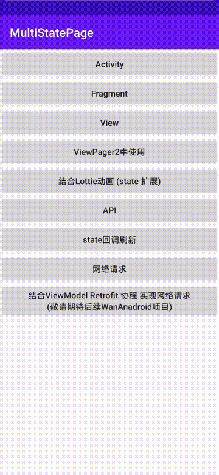

# MultiStatePage
[](https://jitpack.io/#Zhao-Yan-Yan/MultiStatePage)
[](https://github.com/Zhao-Yan-Yan/MultiStatePage/blob/master/LICENSE) 
## 下载Demo

点击或者扫描二维码下载

[](https://www.pgyer.com/1uvC)

| [Activity](app/src/main/java/com/zy/multistatepage/MultiStateActivity.kt) | [Fragment](app/src/main/java/com/zy/multistatepage/MultiFragmentActivity.kt) | [View](app/src/main/java/com/zy/multistatepage/MultiViewActivity.kt) | [ViewPager2](app/src/main/java/com/zy/multistatepage/ViewPager2Activity.kt) |
| :-----: | :----: | :----: | :----: |
|  |  |  |  |

| [Lottie拓展（自定义State）](app/src/main/java/com/zy/multistatepage/LottieExtActivity.kt) | [State刷新](app/src/main/java/com/zy/multistatepage/RefreshStateActivity.kt) | [网络请求](app/src/main/java/com/zy/multistatepage/MockNetActivity.kt) | [mock](app/src/main/java/com/zy/multistatepage/ApiActivity.kt) |
| :-----: | :----: | :----: | :-----: |
|  |  |  |  |

## MultiStatePage的功能及特点
- 无需在布局添加视图代码
- 可显示自定义状态视图,任意拓展
- 可用于 Activity、Fragment、或指定的 View
- 自定义重新请求监听
- 可动态更新视图样式
- 可结合第三方控件使用
- 支持状态回调监听
- kotlin开发更易用的API

## 开始

### 添加依赖
Step1. Add the JitPack repository to your build file
```
allprojects {
    repositories {
        maven { url 'https://jitpack.io' }
    }
}
```

Step2. Add the dependency
```
dependencies {
    implementation 'com.github.Zhao-Yan-Yan:MultiStatePage:$LastVersion'
}
```
LastVersion [](https://jitpack.io/#Zhao-Yan-Yan/MultiStatePage)
### 1.生成MultiStateContainer

#### 在View上使用
基础用法
```kotlin
val multiStateContainer = MultiStatePage.multiState(view)
```
`kotlin` 拓展方法
```kotlin
val multiStateContainer = view.multiState()
```
#### 在Activity 根View中使用
基础用法
```kotlin
class MultiStateActivity : AppCompatActivity() {
    override fun onCreate(savedInstanceState: Bundle?) {
        super.onCreate(savedInstanceState)
        setContentView(R.layout.xxx)
        val multiStateContainer = MultiStatePage.multiStateActivity(this)
    }
}
```
`kotlin` 拓展方法
```kotlin
class MultiStateActivity : AppCompatActivity() {
    override fun onCreate(savedInstanceState: Bundle?) {
        super.onCreate(savedInstanceState)
        setContentView(R.layout.xxx)
        val multiStateContainer = multiStateActivityRoot()
    }
}
```

#### 在Fragment根View中使用

```kotlin
class MultiStateFragment : BaseFragment<FragmentMultiStateBinding>() {
    private lateinit var multiStateContainer: MultiStateContainer
    override fun onCreateView(
        inflater: LayoutInflater,
        container: ViewGroup?,
        savedInstanceState: Bundle?
    ): View? {
        val root = inflater.inflate(R.layout.activity_api, container, false)
        multiStateContainer = MultiStatePage.multiState(root)
        return multiStateContainer
    }
}
```

### 2.切换状态
调用  `MultiStateContainer.show<T>()` 方法

**默认内置3种状态**
```kotlin
val multiStateContainer = MultiStatePage.multiState(view)
//成功页 
multiStateContainer.show<SuccessState>()
//错误页
multiStateContainer.show<ErrorState>()
//空页面
multiStateContainer.show<EmptyState>()
//加载状态页
multiStateContainer.show<LoadingState>()
```

#### 动态设置state

```kotlin
multiStateContainer.show<ErrorState>{errorState->
    errorState.setErrorMsg("xxx出错了")
}
```

#### 设置重试回调

```kotlin
val multiStateContainer = MultiStatePage.multiState(view){
    Toast.makeText(context, "retry", Toast.LENGTH_SHORT).show()
}
```

### 自定义State
#### 1.继承`MultiState`
```kotlin
class LottieWaitingState : MultiState() {
    override fun onCreateMultiStateView(
        context: Context,
        inflater: LayoutInflater,
        container: MultiStateContainer
    ): View {
        return inflater.inflate(R.layout.multi_lottie_waiting, container, false)
    }

    override fun onMultiStateViewCreate(view: View) {
        //逻辑处理
    }

    override fun enableReload(): Boolean = false
}
```
`enableReload()` 是否允许`retry`回调 `false`不允许

#### 2.使用前需register

```kotlin
class LottieExtActivity : AppCompatActivity() {
    override fun onCreate(savedInstanceState: Bundle?) {
        super.onCreate(savedInstanceState)
        MultiStatePage.register(LottieWaitingState())
        val multiStateContainer = multiStateActivityRoot()
        multiStateContainer.show<LottieWaitingState>()
    }
}
```
也可以在Application中注册(建议)
```kotlin
class App : Application() {
    override fun onCreate() {
        super.onCreate()
        MultiStatePage.register(CustomState(), OtherState())
    }
}
```

### 使用内置状态配置

```kotlin
class App : Application() {
    override fun onCreate() {
        super.onCreate()
        MultiStatePage.register(LottieOtherState())

        val config = MultiStateConfig.Builder()
            .alphaDuration(300)
            .errorIcon(R.mipmap.state_error)
            .emptyIcon(R.mipmap.state_empty)
            .emptyMsg("emptyMsg")
            .loadingMsg("loadingMsg")
            .errorMsg("errorMsg")
            .build()

        MultiStatePage.config(config)
    }
}
```
| method | 作用 |
| :-----: | :----: |
| `alphaDuration` | alpha动画时长 |
| `errorIcon` | 错误状态默认图标 |
| `emptyIcon` | 空数据状态默认图标 |
| `emptyMsg` | 空数据状态默认提示信息 |
| `errorMsg` | 错误状态默认提示信息 |
| `loadingMsg` | loading状态默认提示信息 |

### 小技巧
可以借助kotlin的拓展函数封装常用的状态
```kotlin
fun MultiStateContainer.showSuccess(callBack: (SuccessState) -> Unit = {}) {
    show<SuccessState> {
        callBack.invoke(it)
    }
}

fun MultiStateContainer.showError(callBack: (ErrorState) -> Unit = {}) {
    show<ErrorState> {
        callBack.invoke(it)
    }
}

fun MultiStateContainer.showEmpty(callBack: (EmptyState) -> Unit = {}) {
    show<EmptyState> {
        callBack.invoke(it)
    }
}

fun MultiStateContainer.showLoading(callBack: (LoadingState) -> Unit = {}) {
    show<LoadingState> {
        callBack.invoke(it)
    }
}
```

调用
```kotlin
val multiStateContainer = multiStateActivityRoot()
multiStateContainer.showLoading()
```
## 更新日志
- 1.0.1 支持内置状态页信息配置,支持alpha动画时长配置

## Thanks
- [DylanCaiCoding/LoadingHelper](https://github.com/DylanCaiCoding/LoadingHelper/) 
- [KingJA/LoadSir](https://github.com/KingJA/LoadSir)
- [airbnb/lottie-android](https://github.com/airbnb/lottie-android)
- [lottie动画资源社区](https://lottiefiles.com/featured)

**如果对你有帮助的话可以点个star支持一下子 谢谢亲**

## License
```
Copyright (C) 2020. ZhaoYan

Licensed under the Apache License, Version 2.0 (the "License");
you may not use this file except in compliance with the License.
You may obtain a copy of the License at

    http://www.apache.org/licenses/LICENSE-2.0

Unless required by applicable law or agreed to in writing, software
distributed under the License is distributed on an "AS IS" BASIS,
WITHOUT WARRANTIES OR CONDITIONS OF ANY KIND, either express or implied.
See the License for the specific language governing permissions and
limitations under the License.
```
